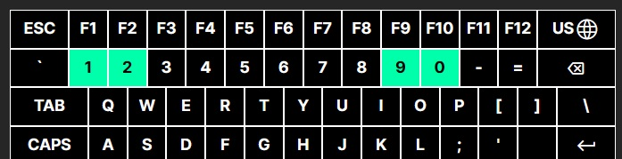
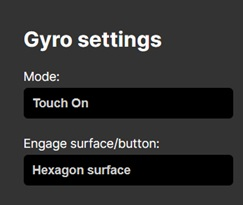

右摇杆映射鼠标：左上设置按键1代表线性模式，2曲线，3恒定。左下代表水平灵敏度，右下代表纵向灵敏度，可设置1~10。

只要这两个设置了并且做开启陀螺仪的动作。ds手柄模式就可以报告陀螺仪数据了。

初版：

GP20(Home)->GP13,GP18(CS0)->GP0,GP19(CS1)->GP1

led：上移12.5mm

r6电阻：左移21.5mm，上移4.75mm

home：上移22.5mm

滚轮：左移16mm

两摇杆间距：51.75mm

修订1：

GP20(Home)->GP13,GP18(CS0)->GP0,GP19(CS1)->GP1

led：上移12.5mm

r6电阻：左移21.5mm，上移4.75mm

home：上移22.5mm

滚轮：左移18.5mm

左摇杆：左移2.5mm

两摇杆间距：52mm

