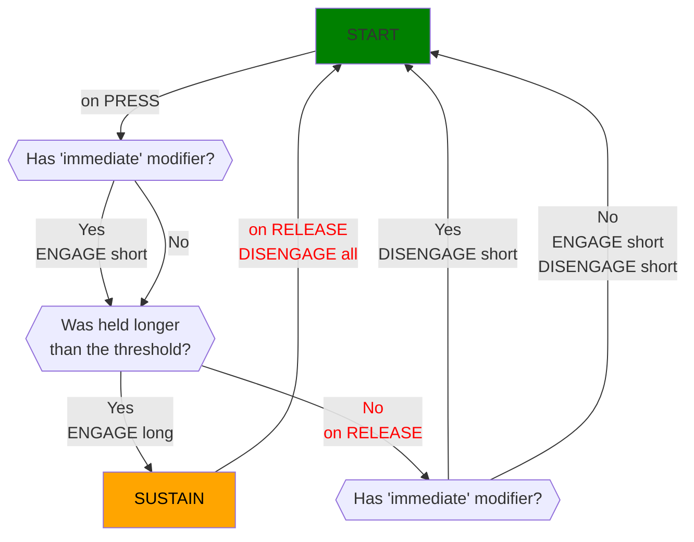
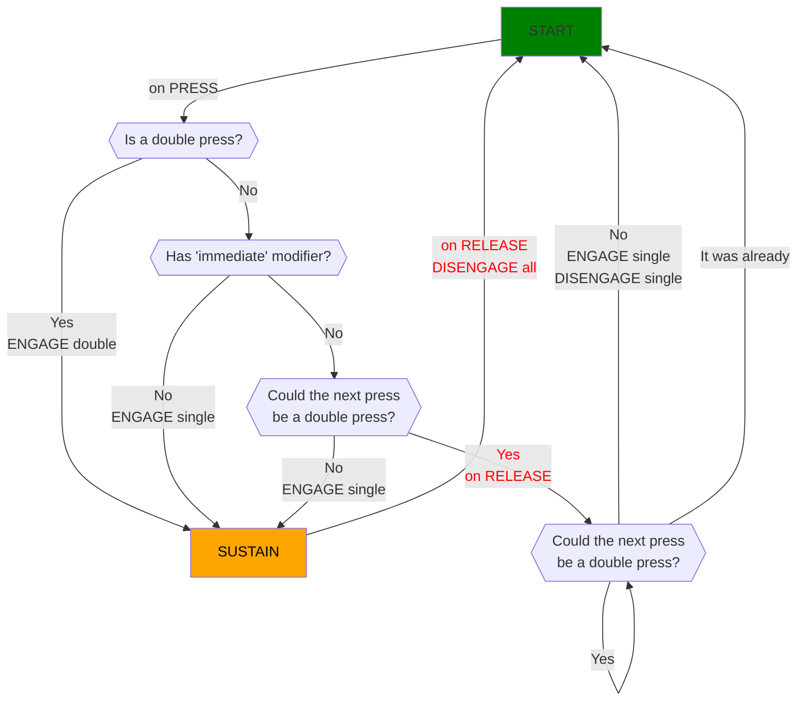

# Buttons

## Supported button modes
Button modes are defined for each button in the profile, and determine the behavior (when and under which conditions) the assigned actions will be triggered, in relation to the physical operations performed on the button.

| MODE | MODIFIERS |
| - | - |
| NORMAL | -
| HOLD | Immediate, Long
| DOUBLE | Immediate
| HOLD + DOUBLE | Immediate, Long
| STICKY | -

### NORMAL mode
When the physical button is pressed, the defined actions are engaged.

When the physical button is released, the defined actions are disengaged.

### HOLD mode
When the physical button is pressed for a short period (shorter than the specified threshold) and released, the defined "short" actions are engaged and immediately disengaged. The delay between the press and release is considered a tradeoff compromise (activation lag).

When the physical button is pressed for a long period (longer than the specified threshold), the defined "long" actions are engaged. Then when the physical button is released the "long" actions are disengaged. In this case the "short" actions are never engaged.

It is compatible with the "LONG" modifier, which increases the time threshold, and therefore how long the button has to be pressed to be considered a long press.

It is compatible with the "IMMEDIATE" modifier, which will make the "short" actions to always be engaged immediately on button press, regardless of the press being considered long press or not later. In the case of a long press, both "short" and "long" set of actions will coexist until the physical button release makes them both to be disengaged. This modifier removes the "activation lag" of the "short" actions, in the cases in which is acceptable to have both set of actions being engaged, but does not change the behavior of the "long" actions.

### DOUBLE mode (aka double press)
When the physical button is pressed a single time (there is a brief delay until is determined that there is no subsequent press) the defined "single" actions are engaged and immediately disengaged. The delay between the initial press and the waiting period for a potential second press is considered a tradeoff compromise (activation lag).

When the physical button is pressed twice (fast enough to be considered double press) the defined "double" actions are engaged. Then when the physical button is released the "double" actions are disengaged.

It is compatible with the "IMMEDIATE" modifier, which will make the "single" actions to always be engaged immediately on button press, regardless of subsequent button presses being considered double press or not later. In the case of a double press, both "single" and "double" sets of actions will coexist until the physical button release makes them both to be disengaged. This modifier removes the "activation lag" of the "single" press, in the cases in which is acceptable to have both set of actions being engaged, but does not change the behavior of the "double" press.

### HOLD and DOUBLE modes combined
When the physical button is pressed a single time (there is a brief delay until is determined that there is no subsequent press), then this initial press will be evaluated for "short" or "long" according to the rules of the HOLD mode.

When the physical button is pressed twice (fast enough to be considered double press) the defined "double" actions are engaged. Then when the physical button is released the "double" actions are disengaged.

The combination of HOLD and DOUBLE logics could be implemented in different ways. The supported combination is `((short OR long) OR double)`. There is no support for determining if holding the button after a double press is considered long or not.

It is compatible with the "LONG" modifier, which increases the (long press) time threshold, and therefore how long the button has to be pressed to be considered a long press.

It is compatible with the "IMMEDIATE" modifier, which will make the "short" actions to always be engaged immediately on button press, regardless of subsequent button presses being considered long press or double press later. In the case of a long press, both "short" and "long" sets of actions will coexist until the physical button release makes them both to be disengaged. In the case of a double press, "short" actions will be engaged/disengaged in the first press/release, and "double actions" will be engaged/disengaged in the second press/release. This modifier removes the "activation lag", in the cases in which is acceptable to have both set of actions being engaged.

### STICKY mode (aka home-cycle)
When the home button is held, the first press on the complementary physical button will engage both "main" and "cycle" sets of actions.

On complementary physical button release, "cycle" actions are disengaged.

On subsequent complementary physical button presses, only "cycle" actions are engaged again.

On home button release, both "main" and "cycle" set of actions are disengaged.

This mode was required for implementing "alt-tabbing" in the home profile, being alt the "main" action, and tab the "cycle" action that can be triggered repeatedly while alt is held.

## Hold state diagram

## Double press state diagram

